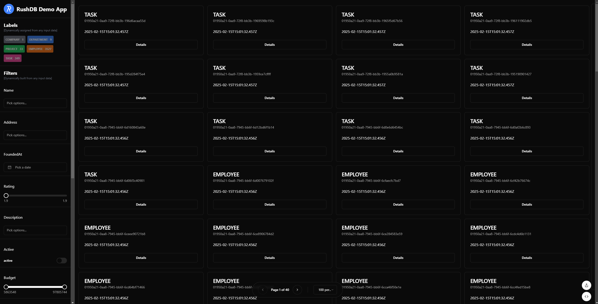
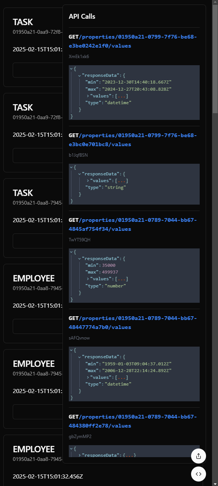

# Next.js RushDB Dynamic Filters Demo

This demo application showcases how to build a dynamic UI with Next.js and the RushDB SDK.
Our UI consists of a data grid and dynamic filters generated from the dataset.
When filters change, the application re-queries the backend for records matching the constructed SearchQuery.
Server-side pagination is also implemented using the RushDB SDK.

## Technology Stack

- **Next.js**
- **RushDB SDK**
- **React & TanStack Query**
- **Tailwind CSS**
- **Radix UI & Lucide**

## About the Project

Using the RushDB SDK and Next.js, we built a UI example that displays data in a grid and provides dynamic filters derived from the dataset.
When filters change, a new SearchQuery is issued to the backend, and matching records are fetched.
Additionally, we integrated server-side pagination using RushDB SDK for efficient data handling.



## Dataset

As a test dataset, we used a JSON file containing a three-level nested array. You can view the original dataset in the file [test-data-example.json](./src/dataset/test-data-example.json).

## UI Utilities & Logging

To help track all operations performed by RushDB, we implemented:

- **Custom Logging**: Every RushDB API call is logged to the developer console.
- **Debug Drawer**: A dedicated UI drawer displays these logs, allowing you to inspect all operations with the RushDB core.



## Package.json

Below is the project's package.json configuration:

```json
{
  "name": "RushDB nextjs example",
  "version": "0.1.0",
  "private": true,
  "scripts": {
    "dev": "PORT=3007 next dev",
    "build": "next build",
    "start": "next start",
    "lint": "next lint",
    "format": "prettier --write \"src/**/*.{ts,tsx,js,jsx,json,css,md}\""
  },
  "dependencies": {
    "@babel/runtime": "latest",
    "@hookform/resolvers": "^3.9.1",
    "@radix-ui/react-accordion": "^1.2.2",
    "@radix-ui/react-alert-dialog": "^1.1.4",
    "@radix-ui/react-aspect-ratio": "^1.1.1",
    "@radix-ui/react-avatar": "^1.1.2",
    "@radix-ui/react-checkbox": "^1.1.3",
    "@radix-ui/react-collapsible": "^1.1.2",
    "@radix-ui/react-context-menu": "^2.2.4",
    "@radix-ui/react-dialog": "^1.1.4",
    "@radix-ui/react-dropdown-menu": "^2.1.4",
    "@radix-ui/react-hover-card": "^1.1.4",
    "@radix-ui/react-icons": "latest",
    "@radix-ui/react-label": "^2.1.1",
    "@radix-ui/react-menubar": "^1.1.4",
    "@radix-ui/react-navigation-menu": "^1.2.3",
    "@radix-ui/react-popover": "^1.1.4",
    "@radix-ui/react-progress": "^1.1.1",
    "@radix-ui/react-radio-group": "^1.2.2",
    "@radix-ui/react-scroll-area": "^1.2.2",
    "@radix-ui/react-select": "^2.1.4",
    "@radix-ui/react-separator": "^1.1.1",
    "@radix-ui/react-slider": "^1.2.2",
    "@radix-ui/react-slot": "^1.1.1",
    "@radix-ui/react-switch": "^1.1.2",
    "@radix-ui/react-tabs": "^1.1.2",
    "@radix-ui/react-toast": "^1.2.4",
    "@radix-ui/react-toggle": "^1.1.1",
    "@radix-ui/react-toggle-group": "^1.1.1",
    "@radix-ui/react-tooltip": "^1.1.6",
    "@rushdb/javascript-sdk": "^1.7.0",
    "@tanstack/react-query": "^5.66.0",
    "@uiw/react-json-view": "^2.0.0-alpha.30",
    "@uiw/react-textarea-code-editor": "latest",
    "autoprefixer": "^10.4.20",
    "class-variance-authority": "^0.7.1",
    "clsx": "^2.1.1",
    "cmdk": "1.0.4",
    "date-fns": "latest",
    "embla-carousel-react": "8.5.1",
    "input-otp": "1.4.1",
    "lucide-react": "^0.454.0",
    "next": "14.2.16",
    "next-themes": "^0.4.4",
    "react": "^18",
    "react-day-picker": "8.10.1",
    "react-dom": "^18",
    "react-hook-form": "^7.54.1",
    "react-resizable-panels": "^2.1.7",
    "recharts": "2.15.0",
    "sonner": "^1.7.1",
    "tailwind-merge": "^2.6.0",
    "tailwindcss": "^3.4.17",
    "tailwindcss-animate": "^1.0.7",
    "vaul": "^0.9.6",
    "zod": "^3.24.1"
  },
  "devDependencies": {
    "@types/node": "^22",
    "@types/react": "^18",
    "@types/react-dom": "^18",
    "@types/react-syntax-highlighter": "^15.5.13",
    "postcss": "^8",
    "prettier": "^3.4.2",
    "typescript": "^5"
  }
}
```
